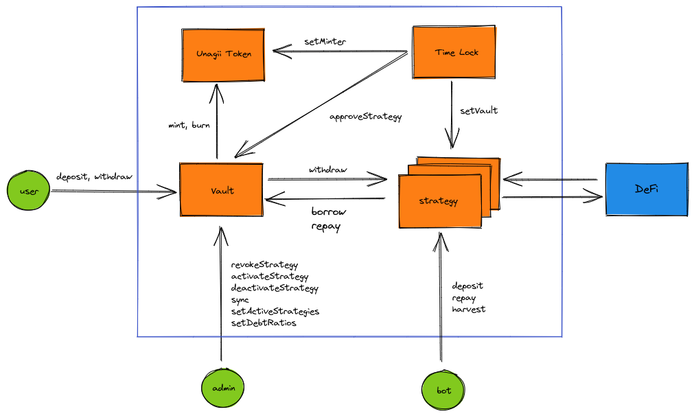

# unagii-vault-v2



### Install

```shell
# install virtualenv
python3 -m pip install --user virtualenv
virtualenv -p python3 venv
source venv/bin/activate

# install vyper
pip install vyper==0.2.12
pip install eth-brownie
pip install eth_account
pip install black
pip install blackadder
pip install slither-analyzer

brownie pm install OpenZeppelin/openzeppelin-contracts@3.4.0

cp .env.sample .env

# npm
npm i
```

### Test

```shell
brownie test tests/path-to-test-file-or-folder
```

### Mainnet Test

```shell
source .env

ganache-cli \
--fork https://mainnet.infura.io/v3/$WEB3_INFURA_PROJECT_ID \
--unlock $DAI_WHALE \
--unlock $USDC_WHALE \
--unlock $USDT_WHALE \
--unlock $WBTC_WHALE \
--networkId 999

env $(cat .env) brownie test tests/mainnet/test.py --network mainnet-fork -s

```

```shell
# black format python
black --check --include "(tests|scripts)" .
# format vyper
blackadder --fast --include '\.vy$' contracts

# select solc compiler
solc-select install 0.8.4
solc-select use 0.8.4

# slither
slither contracts/Contract.sol
```

### Deploy

```shell
brownie accounts new dev

brownie run scripts/flat.py

env $(cat .env) brownie run scripts/script-to-run.py [function] --network ropsten
```

```shell
# ropsten
# TimeLock
0x03ee26271C43B2AA2712F25f6e08E8419aAF5EAD

# TestToken
0xfA4B8F893631814bF47E05a1a29d9d4365A90adD

# uTEST
0x69c529Ec8e451D15c5EB394B3Edaca7304B7ff56
# uETH
0xDdC33E10f60EeC345440Dd49497b1dA38040bd54

# TEST Vault
0x7905D4638DD6B23fcDFBE3e04fEBC911aD87Cde7
# ETH Vault
0xFaEeE4847AEE7a7eC48eb1BB3103E84FB7b4a0D1

# TEST FundManager
0xe9558bC2fC2d8203bFC467Ab67f7016c90400549
# ETH FundManager
0x9Fb96bc1F352F26c0f624556ED39B65fa0a6Ac69

# StrategyTest
0x904a1698b721b4f10A0aC23Ff65BdB3673d7B152
0x446F3C16c87A5DdeD516D404121e7bB847748048
0x4C11CF6c73347Ae013E88dB97b4f285a8DE48322
# StrategyEthTest
0x77845D098a8a789F0A141dD7c9FB5204C1fe8e58
0x86dbA3AA9b04B2758555337AD58b61b4cA03ADd5
0xa46E8Ed416A8dccebAADf320529cBF46eBcf7995

# mainnet (dev)

# udai
0xffd51A24C65CC6981F3A543320fDadaf57ffFD7A
# uusdc
0x8ae16964763Bab7D73c5ECEBe7A51E6827BaED66
# ueth
0x5a6170496aAEC8649B25ec0cd53e55bC38525B00

# dai vault
0x55Ece7dC08f1950245102aD92968bDaE1b359A0a
# usdc vault
0xa32b1c0703B80E7bF40D172CC86Da8C620024AE6
# eth vault
0x7F129B99d81e5ac772B24BFb6af2f71309851F4C

# dai fund manager
0x8a90faDe80feadCDD595c4f3611eB1886c924b61
# usdc fund manager
0xf01c9a51ff69fC2982156be9D558d56002328Fcc
# eth fund manager
0x09f15F979Bf1b0CC8c8a19ed2E2feFF8EdE60e54

# mainnet
```
